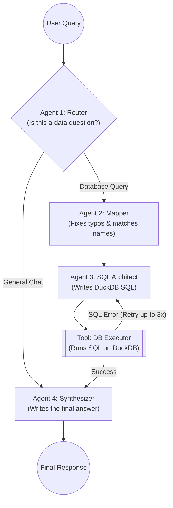

# 📊 Agentic Data Analyst (LangGraph + DuckDB)

   

## 📖 Project Overview

This project is an intelligent **Text-to-SQL AI Assistant**. It allows users to upload large structured datasets (CSV or Excel files) and ask natural language questions about them. 

Instead of struggling with context window limits or hallucinated math, this system uses **DuckDB** to execute real SQL queries. A team of AI agents orchestrated by **LangGraph** works together to understand the question, fix typos in the user's prompt, write the SQL code, execute it, fix its own errors, and return a plain English answer.

---

## 🏗️ System Architecture

The workflow uses a multi-agent state machine. Here is how the agents collaborate to solve a user's question:



## 🤖 Meet the Agents (How it Works)

The system relies on 4 specialized agents and 1 execution tool:

### 1. The Router (The "Traffic Cop")
* **Purpose:** Looks at the user's prompt and decides where to send it.
* **Logic:** If the user says "Hello," it routes directly to the Synthesizer. If the user asks "What was the revenue in 2024?", it routes to the Data pipeline.

### 2. The Mapper (The "Spell Checker")
* **Purpose:** Solves the "Fuzzy Matching" problem. Users rarely type exact database names (e.g., they type "Apple" instead of "Apple Inc.").
* **Logic:** It uses an AI Vector Database (FAISS) to search the user's text against the actual values in the Excel file. It rewrites the user's question to use the exact, correct spelling before writing any code.

### 3. The SQL Architect (The "Coder")
* **Purpose:** Writes the actual data query.
* **Logic:** It looks at the database schema (columns and data types) and the cleaned question from the Mapper. It then generates valid, optimized DuckDB SQL code to calculate the answer.

### 4. The Executor (The "Database Engine")
* **Purpose:** Runs the SQL code on DuckDB.
* **Superpower (Self-Correction):** If the SQL Architect writes bad code (e.g., misspelled a column name), the database throws an error. The Executor catches this error, sends it *back* to the SQL Architect, and says, "Try again, here is the error."

### 5. The Synthesizer (The "Spokesperson")
* **Purpose:** Translates raw database rows into a human-friendly sentence.
* **Logic:** It takes the raw JSON/Number from the database (e.g., `[{"Total": 5000}]`) and replies to the user: *"The total revenue was $5,000."*

---

## 🚀 Setup & Installation

**Prerequisites:** Docker and Docker Compose installed on your machine.

**1. Clone the repository and enter the directory:**
```bash
git clone https://github.com/YOUR_USERNAME/data-analyst-agent.git
cd data-analyst-agent
```

**2. Create the environment file:**
Copy the example file and add your Azure OpenAI keys.
```bash
cp .env.example .env
```

**3. Build and start the application:**
```bash
docker-compose up --build
```

**4. Access the API Documentation:**
Open your browser and navigate to: [http://localhost:8080/docs](http://localhost:8080/docs)

---

## ⚡ Usage Example

### Step 1: Upload your Data (Ingest)
Upload a `.csv` or `.xlsx` file using the `/ingest` endpoint. 
> *Behind the scenes: The system loads this into lightning-fast DuckDB and maps the unique text entities to FAISS.*

### Step 2: Ask a Question (Query)
Send a POST request to `/query`:
```json
{
  "question": "What is the total revenue for Apple in 2024?"
}
```

**Expected Output:**
```json
{
  "answer": "The total revenue for Apple Inc. in 2024 was $383 Billion USD.",
  "generated_sql": "SELECT SUM(Revenue) FROM dataset WHERE Company_Name = 'Apple Inc.' AND Year = 2024;"
}
```

